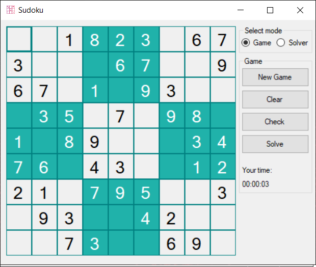

# Sudoku

Sudoku is an app with graphic interface for playing and soliving a classic Sudoku game.

## Functionalities
* Generating a unique sudoku puzzle
* Entering the numbers from keyboard
* Checking the user solution
* Stopwatch
* Solving the puzzle

To add:
* Abbility for user to add a puzzle and then solve it using the built in sudoku solving algorithm.

## Technologies
The app was written using C# and Windows Forms (Microsoft .NET Framework).

## Setup
For download this app click [here](https://drive.google.com/file/d/1MupDGXKDKCxRPBtX9vcHyL-Mm4jj7ihT/view?usp=sharing).

## Screenshots
